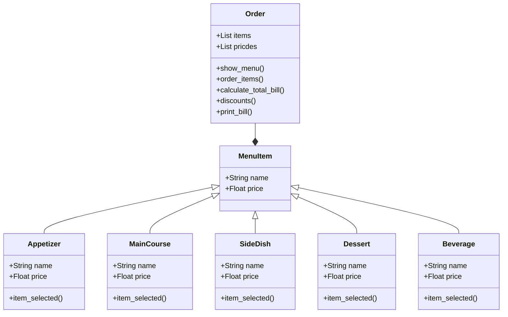

# Reto número 3 repo POO

 ### **Fecha:** 04-03-2024

**1.** Class exercise:

* Mirar archivo ejercicio_en_clase_1.py

```python
class Point:                                            # Class Point for the coordinate left_corner point
    definition: str = "It's the coordinate of a point in the Cartesian plane"  # Class attributes

    def __init__(self, x=0, y=0):                       # Instance attributes, class constructure
        self.x = x                                      # Initialize x
        self.y = y                                      # Initialize y

    def move(self, new_x, new_y):                       # Use to control modifications
        self.x = new_x
        self.y = new_y

    def reset(self):                                    # Use to control modifications
        self.x = 0
        self.y = 0

class Line:                                             # Class Line
    definition: str = "It's the geometric form of a Line in the Cartesian plane"  # Class attributes
    def __init__(self, start_point, end_point):      # Instance attributes, class constructure                         
        self.start_point = start_point 
        self.end_point = end_point                       

    def compute_length(self):                             
        self.length = (((self.end_point.x - self.start_point.x) ** 2) +
                       ((self.end_point.y - self.start_point.y) ** 2)) ** 0.5
        return self.length

    def compute_slope(self):                            
        self.slope_rad = (self.end_point.y - self.start_point.y) / (self.end_point.x - self.start_point.x)
        slope_deg = self.slope_rad * (180 / 3.1416)
        return slope_deg

    def compute_horizontal_cross(self):                            
        if self.start_point.x <= 0:
            if self.end_point.x <= 0:
                return False
            else: 
                return True
        elif self.end_point.x <= 0:
            if self.start_point.x <= 0:
                return False
            else: 
                return True
        else: return False

    def compute_vertical_cross(self):                            
        if self.start_point.y <= 0:
            if self.end_point.y <= 0:
                return False
            else: 
                return True
        elif self.end_point.y <= 0:
            if self.start_point.y <= 0:
                return False
            else: 
                return True
        else: return False

class Rectangle:                                        # Class Rectangle 
    definition: str = "It's the geometric form of a Rectangle in the Cartesian plane"  # Class attributes

    def __init__(self, method):     # Instance attributes, class constructure

        if method == 1:                                         # If its with the 1st method
            left_corner_x = float(input("Insert x component of the left corner point: "))
            left_corner_y = float(input("Insert y component of the left corner point: "))
            left_corner = Point(x=left_corner_x, y=left_corner_y)   

            width = float(input("Insert the width of the rectangle: "))
            height = float(input("Insert the height of the rectangle: "))

            self.left_corner = left_corner                  # Initialize left_corner
            self.width = width                              # Initialize width
            self.height = height                            # Initialize height

        elif method == 2:                                       # If its with the 2nd method
            center_point_x = float(input("Insert x component of the center point: "))
            center_point_y = float(input("Insert y component of the center point: "))

            width = float(input("Insert the width of the rectangle: "))
            height = float(input("Insert the height of the rectangle: "))

            left_corner_x = center_point_x - (width / 2)
            left_corner_y = center_point_y - (height / 2)
            left_corner = Point(x=left_corner_x, y=left_corner_y)

            self.left_corner = left_corner                  # Initialize left_corner
            self.width = width                              # Initialize width
            self.height = height                            # Initialize height

        elif method == 3:                                       # If its with the 3rd method
            left_corner_x = float(input("Insert x component of the left corner point: "))
            left_corner_y = float(input("Insert y component of the left corner point: "))
            left_corner = Point(x=left_corner_x, y=left_corner_y)

            right_corner_x = float(input("Insert x component of the right corner point: "))
            right_corner_y = float(input("Insert y component of the right corner point: "))

            width=right_corner_x-left_corner_x
            height=right_corner_y-left_corner_y

            self.left_corner = left_corner                  # Initialize left_corner
            self.width = width                              # Initialize width
            self.height = height                            # Initialize height

        elif method==4:                                         # If its with the 4th method         # If its with the 4th method
            lines = []
            for i in range(4):
                start_point_x = float(input("Insert x component of the start point of the line: "))
                start_point_y = float(input("Insert y component of the start point of the line: "))
                start_point = Point(x=start_point_x, y=start_point_y) 

                end_point_x = float(input("Insert x component of the end point of the line: "))
                end_point_y = float(input("Insert y component of the end point of the line: "))
                end_point = Point(x=end_point_x, y=end_point_y) 

                line = Line(start_point=start_point, end_point=end_point)
                lines.append(line)

            # Verificar si las líneas forman un rectángulo (nueva forma)
            dot_products = [
                (lines[0].end_point.x - lines[0].start_point.x) * (lines[1].end_point.x - lines[1].start_point.x) +
                (lines[0].end_point.y - lines[0].start_point.y) * (lines[1].end_point.y - lines[1].start_point.y),

                (lines[1].end_point.x - lines[1].start_point.x) * (lines[2].end_point.x - lines[2].start_point.x) +
                (lines[1].end_point.y - lines[1].start_point.y) * (lines[2].end_point.y - lines[2].start_point.y),

                (lines[2].end_point.x - lines[2].start_point.x) * (lines[3].end_point.x - lines[3].start_point.x) +
                (lines[2].end_point.y - lines[2].start_point.y) * (lines[3].end_point.y - lines[3].start_point.y),

                (lines[3].end_point.x - lines[3].start_point.x) * (lines[0].end_point.x - lines[0].start_point.x) +
                (lines[3].end_point.y - lines[3].start_point.y) * (lines[0].end_point.y - lines[0].start_point.y)
            ]

            if all(dot_product == 0 for dot_product in dot_products):
                # Si todos los productos punto son cero, las líneas son ortogonales
                self.left_corner = Point(
                    x=min(min(line.start_point.x, line.end_point.x) for line in lines),
                    y=min(min(line.start_point.y, line.end_point.y) for line in lines)
                )
                self.width = max(max(line.end_point.x, line.start_point.x) for line in lines) - self.left_corner.x
                self.height = max(max(line.end_point.y, line.start_point.y) for line in lines) - self.left_corner.y
            else:
                print("Not a rectangle")

        else:
            print("No valid number")

    def compute_area(self):                             # Function for its area
        area = self.width * self.height
        return area

    def compute_perimeter(self):                        # Function for its perimeter
        perimeter = 2 * (self.width + self.height)
        return perimeter
    
    def compute_interference_point(self, point: Point) -> bool:
        if (self.left_corner.x <= point.x <= self.left_corner.x + self.width) and (self.left_corner.y <= point.y <= self.left_corner.y + self.height):
            return True
        else:
            return False

class Square(Rectangle):                                # Class Square 
    definition: str = "It's the geometric form of a Square in the Cartesian plane"

    def __init__(self, rectangle: Rectangle):
        super().__init__(method)
        self.left_corner = rectangle.left_corner
        self.width = rectangle.width

# Method

print("Insert 1 if your method to initialize the rectangle is with the left_corner, width, and height")     # Select the method to inicialice
print("Insert 2 if your method to initialize the rectangle is with the center_point, width, and height")
print("Insert 3 if your method to initialize the rectangle is with two opposite corners")
print("Insert 4 if your method to initialize the rectangle with 4 lines")
method = int(input(": "))

# Rectangle

print("\nFor the Rectangle") 

rectangle_1 = Rectangle(method)
print(rectangle_1.compute_area())
print(rectangle_1.compute_perimeter())

# Square

print("\nFor the Square") 

square_1 = Square(rectangle_1)
print(square_1.compute_area())
print(square_1.compute_perimeter())

print("\n") 

# Verification point

point_x = float(input("Insert x component of the point you want to know if it's inside the rectangle: "))
point_y = float(input("Insert y component of the point you want to know if it's inside the rectangle: "))
verify_point = Point(point_x, point_y)

print("\n") 

print(rectangle_1.compute_interference_point(verify_point))

# Verification line

print("\n") 

start_point_x = float(input("Insert x component of the start point of the line: "))
start_point_y = float(input("Insert y component of the start point of the line: "))
start_point = Point(x=start_point_x, y=start_point_y) 

end_point_x = float(input("Insert x component of the end point of the line: "))
end_point_y = float(input("Insert y component of the end point of the line: "))
end_point = Point(x=end_point_x, y=end_point_y) 

print("\nFor the Line") 

line = Line(start_point=start_point, end_point=end_point)
print(line.compute_length())
print(line.compute_slope())
print(line.compute_horizontal_cross())
```

**2.** Diagrama de las clases del restaurante para crear el codigo:



**3.** Codigo Restaurante

* Mirar archivo alejas_restaurant.py

```python
class MenuItem:                                          

    def __init__(self, name, price):
        self.name = name       
        self.price = price  

class Appetizer(MenuItem):                              # Clase appetizer hereda name y price de ManuItem
    def __init__(self, name):
        super().__init__(name, price=0)
    
    def item_selected(self):                            # Se definen los elementos que puede elegir el usuario con su precio correspondiente
        name = self.name
        if name == "bruschetta":
            return 7.99
        elif name == "spinach and artichoke dip":
            return 8.49
        elif name == "caprese salad":
            return 9.99
        elif name == "stuffed mushrooms":
            return 10.49
        elif name == "shrimp cocktail":
            return 12.99
        else:
            return 0

class MainCourse(MenuItem):                             # Mismo sentido que la clase Appetizer
    def __init__(self, name):
        super().__init__(name, price=0)
    
    def item_selected(self):
        name = self.name
        if name == "grilled salmon":
            return 16.99
        elif name == "chicken parmesan":
            return 14.99
        elif name == "beef tenderloin steak":
            return 22.99
        elif name == "vegetable stir fry":
            return 12.99
        elif name == "pasta with grilled chicken":
            return 15.49
        else:
            return 0

class SideDish(MenuItem):                               # Mismo sentido que la clase Appetizer
    def __init__(self, name):
        super().__init__(name, price=0)
    
    def item_selected(self):
        name = self.name
        if name =="french fries":
            return 3.99
        elif name =="mashed potatoes":
            return 4.49
        elif name =="steamed vegetables":
            return 5.29
        elif name =="garlic bread":
            return 3.99
        elif name =="onion rings":
            return 4.99
        else:
            return 0

class Dessert(MenuItem):                                # Mismo sentido que la clase Appetizer
    def __init__(self, name):
        super().__init__(name, price=0)
    
    def item_selected(self):
        name = self.name
        if name=="chocolate cake":
            return 6.99
        elif name=="cheesecake":
            return 5.49
        elif name=="tiramisu":
            return 7.99
        elif name=="apple pie":
            return 4.99
        elif name=="ice cream":
            return 4.79
        else:
            return 0

class Beverage(MenuItem):                               # Mismo sentido que la clase Appetizer
    def __init__(self, name):
        super().__init__(name, price=0)
    
    def item_selected(self):
        name = self.name
        if name=="soda":
            return 1.99
        elif name=="juice":
            return 2.49
        elif name=="coffee":
            return 2.99
        elif name=="iced tea":
            return 2.29
        elif name=="smoothie":
            return 4.99
        else:
            return 0

class Order:                                            # En esta clase se define el menu, lo que ingresa el usuario, el total, del recibo, descuentos e imprime la factura
    def __init__(self):
        self.items = [] 
        self.prices=[]

    def show_menu(self):                                # Se muestra el menu
        print("Alejas Restaurant")

        print("\nAppetizer:")
        print("Bruschetta..............................7.99")
        print("Spinach and artichoke dip...............8.49")
        print("Caprese salad...........................9.99")
        print("Stuffed mushrooms......................10.49")
        print("Shrimp cocktail........................12.99")
        
        print("\nMain Course:")
        print("Grilled salmon.........................16.99")
        print("Chicken parmesan.......................14.99")
        print("Beef tenderloin steak..................22.99")
        print("Vegetable stir fry.....................12.99")
        print("Pasta with grilled chicken.............15.49")

        print("\nSide Dish")
        print("French fries............................3.99")
        print("Mashed potatoes.........................4.49")
        print("Steamed vegetables......................5.29")
        print("Garlic bread............................3.99")
        print("Onion rings.............................4.99")

        print("\nDessert")
        print("Chocolate cake..........................6.99")
        print("Cheesecake..............................5.49")
        print("Tiramisu................................7.99")
        print("Apple pie...............................4.99")
        print("Ice cream...............................4.79")

        print("\nBeverage")
        print("Soda...................................1.99")
        print("Juice..................................2.49")
        print("Coffee.................................2.99")
        print("Iced tea...............................2.29")
        print("Smoothie...............................4.99")

        print("\n")

    def order_items(self):                              # Es todo lo que ingresa el usuario
        items=self.items
        prices=self.prices

        quantity_appetizer=int(input("Insert the quantity of appetizer: "))
        for i in range (quantity_appetizer):
            name_appetizer = input("Insert your Appetizer: ").lower()
            appetizer=Appetizer(name_appetizer)
            items.append(appetizer)
            price=appetizer.item_selected()
            prices.append(price)

        quantity_maincourse=int(input("Insert the quantity of main course: "))
        for i in range (quantity_maincourse):
            name_maincourse=input("Insert your MainCourse: ").lower()
            maincourse=MainCourse(name_maincourse)
            items.append(maincourse)
            price=maincourse.item_selected()
            prices.append(price)

        quantity_sidedish=int(input("Insert the quantity of side dish: "))
        for i in range (quantity_sidedish):
            name_sidedish=input("Insert your SideDish: ").lower()
            sidedish=SideDish(name_sidedish)
            items.append(maincourse)
            price=sidedish.item_selected()
            prices.append(price)

        quantity_dessert=int(input("Insert the quantity of dessert: "))
        for i in range (quantity_dessert):
            name_dessert=input("Insert your Dessert: ").lower()  
            dessert=Dessert(name_dessert)
            items.append(dessert)
            price=dessert.item_selected()
            prices.append(price)

        quantity_beverage=int(input("Insert the quantity of beverage: "))
        for i in range (quantity_beverage):
            name_beverage=input("Insert your Beverage: ").lower() 
            beverage=Beverage(name_beverage)
            items.append(beverage)
            price=beverage.item_selected()
            prices.append(price)

    def calculate_total_bill(self):                     # Se calcula el total de la factura
        total_bill=0
        prices=self.prices
        for i in prices:
            total_bill=total_bill+i
        return total_bill

    def discounts(self):                                # Se evalua si tiene descuentos
        total_bill=self.calculate_total_bill()
        if total_bill>40.00:
            bill_with_discounts=total_bill-((total_bill*5)/100)
            return bill_with_discounts
        else:
            return total_bill
    
    def print_bill(self):                               # Se imprime la factura
        items=self.items
        total_bill=self.calculate_total_bill()
        discounts=self.discounts()

        print("Your bill:\n")
        for item in items:
            name = item.name
            price = 0.0
            if name == "bruschetta":
                price = 7.99
            elif name == "spinach and artichoke dip":
                price = 8.49
            elif name == "caprese salad":
                price = 9.99
            elif name == "stuffed mushrooms":
                price = 10.49
            elif name == "shrimp cocktail":
                price = 12.99
            elif name == "grilled salmon":
                price = 16.99
            elif name == "chicken parmesan":
                price = 14.99
            elif name == "beef tenderloin steak":
                price = 22.99
            elif name == "vegetable stir fry":
                price = 12.99
            elif name == "pasta with grilled chicken":
                price = 15.49
            elif name == "french fries":
                price = 3.99
            elif name == "mashed potatoes":
                price = 4.49
            elif name == "steamed vegetables":
                price = 5.29
            elif name == "garlic bread":
                price = 3.99
            elif name == "onion rings":
                price = 4.99
            elif name == "chocolate cake":
                price = 6.99
            elif name == "cheesecake":
                price = 5.49
            elif name == "tiramisu":
                price = 7.99
            elif name == "apple pie":
                price = 4.99
            elif name == "ice cream":
                price = 4.79
            elif name == "soda":
                price = 1.99
            elif name == "juice":
                price = 2.49
            elif name == "coffee":
                price = 2.99
            elif name == "iced tea":
                price = 2.29
            elif name == "smoothie":
                price = 4.99
            print("{:<27}{}".format(name.capitalize(), "{:.2f}".format(price)))        # El format es para que se formatee cada vez
        print("\n")
        print("Your order costs: " + str(total_bill))
        if discounts!=total_bill:
            print("\n")
            print("Congrats! You obtain a discount of 5% in your bill")
            print("Your total cost is: " + str(discounts))

my_order = Order()
my_order.show_menu()
my_order.order_items()
print("\n")
my_order.print_bill()
```
